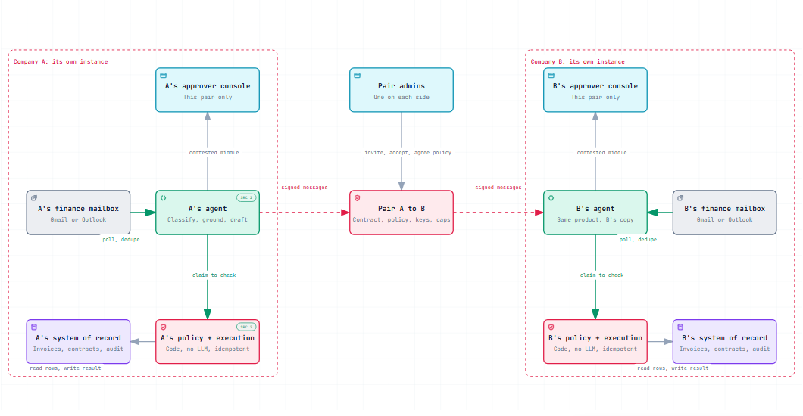
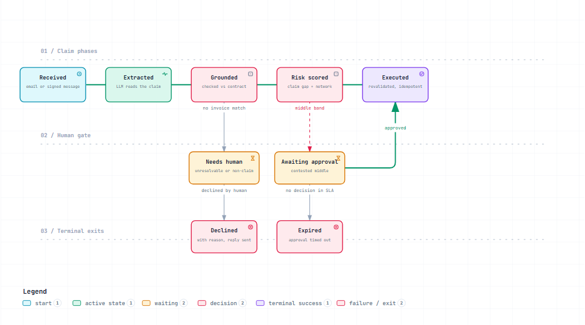
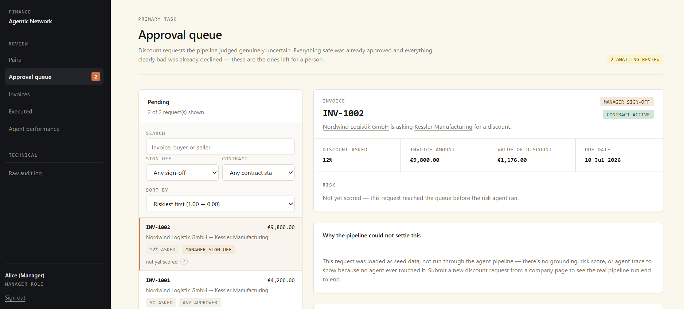
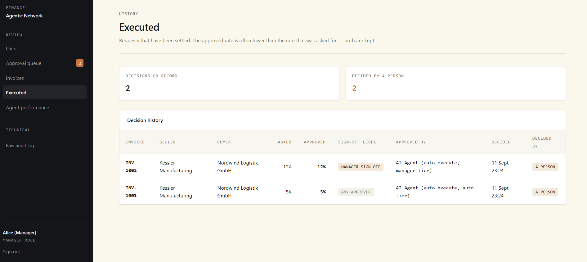
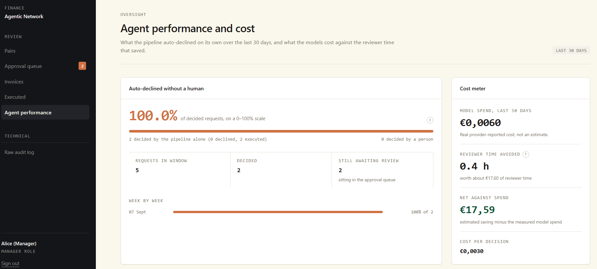
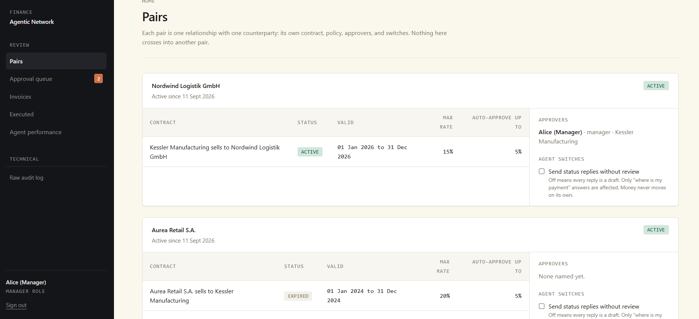
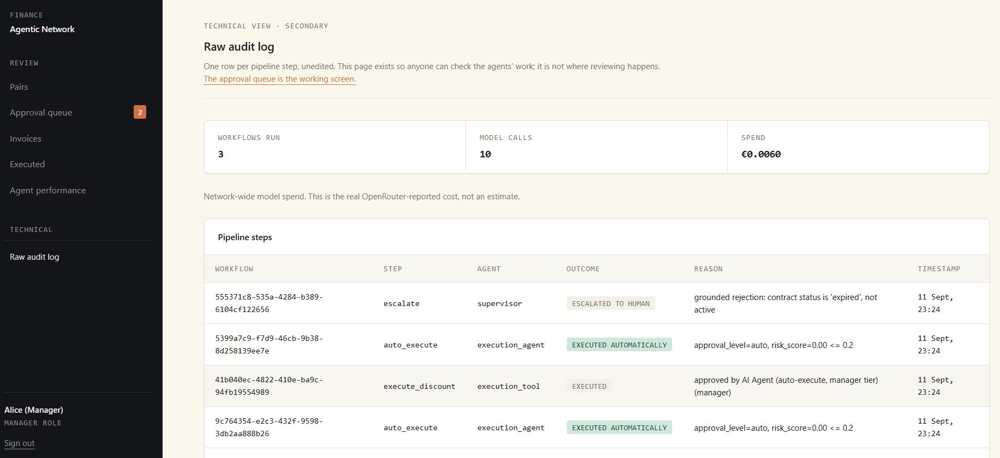
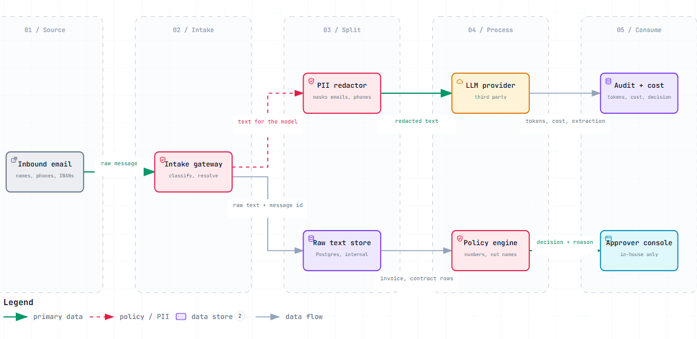

<div align="center">

# Finance Agentic Network

**A multi-agent finance-ops platform where the LLM reads and drafts, and code decides.**

LangGraph orchestration · Postgres + Neo4j grounding · real Gmail intake · propose/execute split · MCP tool server · prompt-injection tests · a 50-case eval set


</div>

<br>

<table align="center">
  <tr>
    <td align="center"><h2>0</h2>LLM calls on the<br>execution path</td>
    <td align="center"><h2>10</h2>threads racing one claim:<br>1 wins, 9 safe no-ops</td>
    <td align="center"><h2>4</h2>adversarial email bodies<br>run against the live graph</td>
    <td align="center"><h2>82 → 96%</h2>intent accuracy after<br>one prompt revision</td>
    <td align="center"><h2>50</h2>hand-labelled cases in<br>the golden set</td>
  </tr>
</table>

<br>

## What it models

A network of companies that trade with each other. Each company runs its own instance. Company A's agent reads A's finance mailbox, checks claims against A's contracts, and drafts replies. Nothing crosses to company B except signed messages under a pairing both sides accepted.

<p align="center"></p>

## The one workflow it proves end to end

```mermaid
flowchart LR
    G[Gmail inbox] --> T[Intake / triage<br/><i>LLM classifies intent</i>]
    T --> X[Document extraction<br/><i>LLM reads the claim</i>]
    X --> V[Finance validation<br/><i>code</i>]
    V --> P[Policy agent<br/><i>Neo4j-grounded</i>]
    P --> R[Risk agent<br/><i>scoring only</i>]
    R --> D{{propose_discount<br/><i>deterministic, 0 LLM calls</i>}}
    D --> H[Human approval]
    H --> E[execute<br/><i>re-validates eligibility</i>]
    E --> A[(Audit log)]

    classDef llm fill:#FFF3E0,stroke:#EF6C00,color:#000
    classDef code fill:#E8F5E9,stroke:#2E7D32,color:#000
    classDef gate fill:#FCE4EC,stroke:#C62828,color:#000
    class T,X,P,R llm
    class V,E,A code
    class D,H gate
```



<p align="center"><sub>orange = an LLM reads or drafts · green = deterministic code · red = the gate nothing skips</sub></p>

The model's reading of a claimed discount rate is recorded but never trusted. A function with zero LLM calls re-derives eligibility from Postgres (contract status, rate ceiling, remaining budget) before anything happens. That split is the point of the whole build.

## Where a claim can end up

<p align="center"></p>

Low risk executes, high risk declines, the middle band waits for an approver. Silence past the SLA expires the claim. A refused execution re-queues instead of dropping.

## The approver's screen

The pipeline settles what it can. The approval queue holds only the requests it judged uncertain, sorted riskiest first, with the reason it could not settle each one.

<p align="center"></p>

<table>
  <tr>
    <td width="50%"><br><sub><b>Executed.</b> Asked rate and approved rate are both kept, with the sign-off tier and who decided.</sub></td>
    <td width="50%"><br><sub><b>Agent performance and cost.</b> Share decided without a person, real provider-reported spend, reviewer time avoided, cost per decision.</sub></td>
  </tr>
  <tr>
    <td width="50%"><br><sub><b>Pairs.</b> One relationship per counterparty: contract, max rate, auto-approve ceiling, approvers, and the switch that lets the agent send status replies unreviewed.</sub></td>
    <td width="50%"><br><sub><b>Raw audit log.</b> One row per pipeline step, unedited: agent, outcome, reason, timestamp, plus network-wide model calls and spend.</sub></td>
  </tr>
</table>

## What the LLM does, and what it never does

| The model | Code |
|---|---|
| Classifies the intent of an email | Resolves the invoice from sender company plus quoted number or amount |
| Reads the claimed rate and the reason out of the text and attachments | Re-derives eligibility from contract status, rate ceiling and budget |
| Drafts the reply and the risk explanation | Decides the number, every time |
| Nothing else | Checks role rank and contract expiry again at execution, even against its own prior output |

## Guardrails that are enforced, not documented

| Guardrail | How it is enforced | Where |
|---|---|---|
| Propose, then approve | `ground_decision` runs with zero LLM calls before any proposal is stored | `src/orchestration/nodes.py` |
| Zero-trust execution | `execute_discount` re-validates eligibility and role rank on every call. 10-thread race: exactly one wins, nine see a safe no-op | `src/tools/execution.py` |
| Prompt-injection resistance | Four adversarial email bodies through the real graph with real model calls. Each held for a different reason: rate clamping, ignored fake fields, intent routing before extraction, out-of-band approver parameter | `src/guardrails/injection_tests.py` |
| Defense in depth | A full-authority approver is still blocked by an expired contract | `src/tools/execution.py` |
| PII redaction | Names, phones and IBANs are masked before text leaves for the model. Raw text stays in Postgres | `src/guardrails/pii_redaction.py` |
| Cost tracking, rate limiting, session auth, CSRF | Per-call token and cost log, request limits, signed sessions | `src/guardrails/`, `src/api/` |

<p align="center"></p>

## Evaluation set

Every model-facing read is scored against answers a person wrote into `evals/golden_set.jsonl`. Each run writes per-case outcomes to `evals/results/` so a regression is visible as a diff, not a feeling.

| Read | Scored how | Result (2026-09-08) |
|---|---|---|
| Intent | Same prompt and schema as `intake_triage` | 48 / 50 after tightening the prompt (41 / 50 before) |
| Invoice | The resolver: sender company plus quoted number or amount | 50 / 50 |
| Rate | Same prompt and schema as `extract_claim`, discount cases only | 13 / 13 |

The first run put eight `other` emails into `status_inquiry`. One prompt revision fixed it. The run files are in the repo, both of them.

```bash
uv run python -m evals.run            # all cases
uv run python -m evals.run --no-llm   # resolver only, no model calls
```

## Multi-LLM routing

One OpenRouter key. A cheap tier (Haiku) for classification and extraction, a strong tier (Sonnet) for narrative and risk explanation. The number is always decided by code, never by the model.

## Tech stack

Python · LangGraph · LangChain (OpenRouter-backed) · FastAPI · Postgres · Neo4j · MCP (`mcp` SDK) · PyMuPDF (vision-based document extraction) · Gmail API (OAuth2) · Jinja2 · React / TanStack frontend

<details>
<summary><b>Repo layout</b></summary>

```
docs/prd.md                  product requirements
docs/diagrams/               Archify sources for every diagram in this README
docs/decisions/adr/          architecture decision records
docs/demo_script.md          walkthrough of the live demo
src/orchestration/           LangGraph graph + nodes
src/tools/                   deterministic policy and calc logic, the execution tool
src/ontology/                Postgres schema, Neo4j sync
src/ingestion/               Gmail intake, document extraction
src/guardrails/              audit log, policy gate, PII redaction, cost tracker, injection tests
src/api/                     FastAPI app (JSON API + server-rendered pages)
src/mcp_server/              MCP server wrapping the policy-lookup tools
evals/                       golden set, runner, per-run results
frontend/                    React / TanStack UI, talks to /api/*
data/seed/                   sample companies, contracts, invoices
```

</details>

## Running it

```bash
docker compose up -d                        # Postgres + Neo4j
uv sync                                     # needs uv: https://docs.astral.sh/uv/
uv run alembic upgrade head                 # schema; every change is a file under migrations/
uv run python -m data.seed.seed
uv run python -m src.ontology.sync_graph
uv run python -m src.orchestration.graph   # full workflow against 4 seeded invoices
uv run uvicorn src.api.main:app --port 8000
```

Needs `OPENROUTER_API_KEY` in `.env` (see `.env.example`). Gmail intake also needs a Google Cloud OAuth client (Desktop app type). `BRAIN.md` has the long version, the full security audit and every bug found by clicking through the running app.

## Honest gaps

A scoped demo, not a finished product.

- Per-agent tool allowlisting and step, retry and cost limits are designed but not structurally enforced.
- Document processing has no sandboxing for untrusted attachments.
- No multi-provider fallback: both tiers are Claude, at different sizes.
- External-to-internal invoice-number reconciliation is an unsolved matching problem, found by testing against a real generated invoice.
